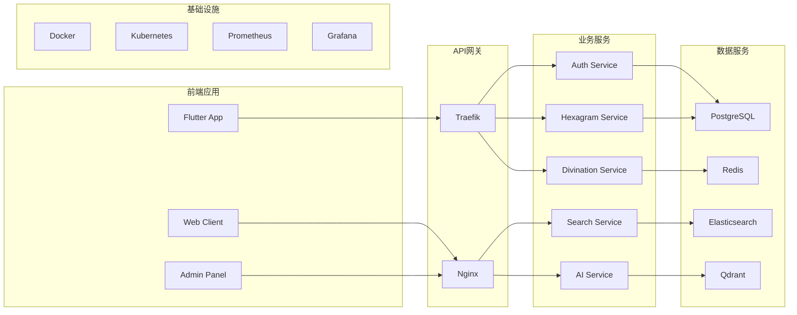
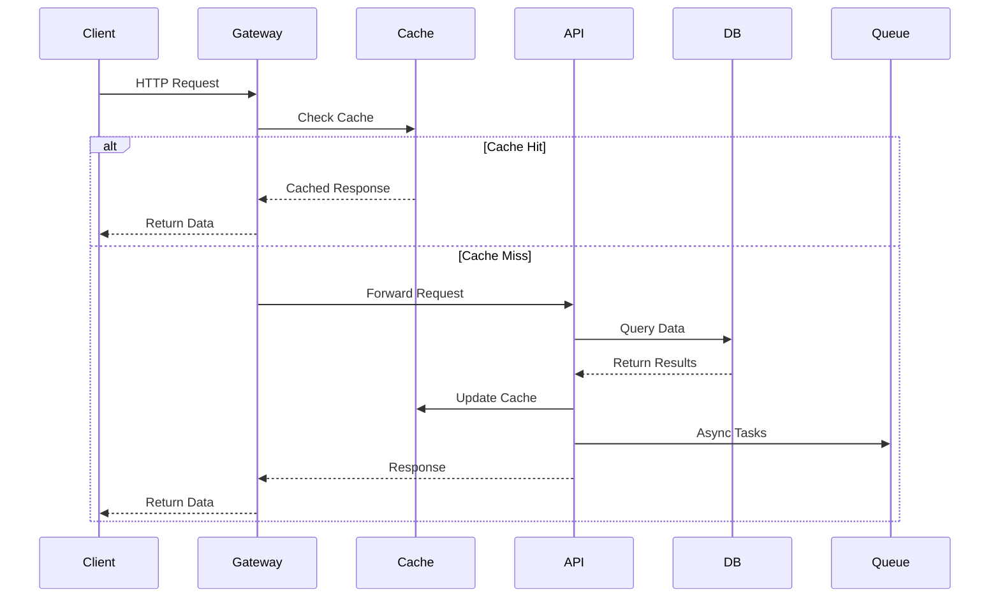
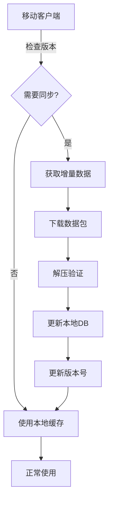
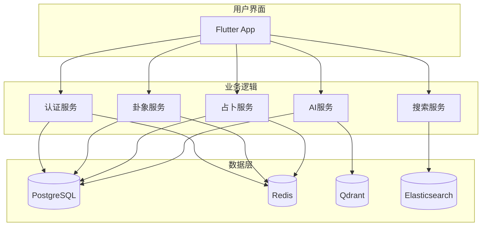
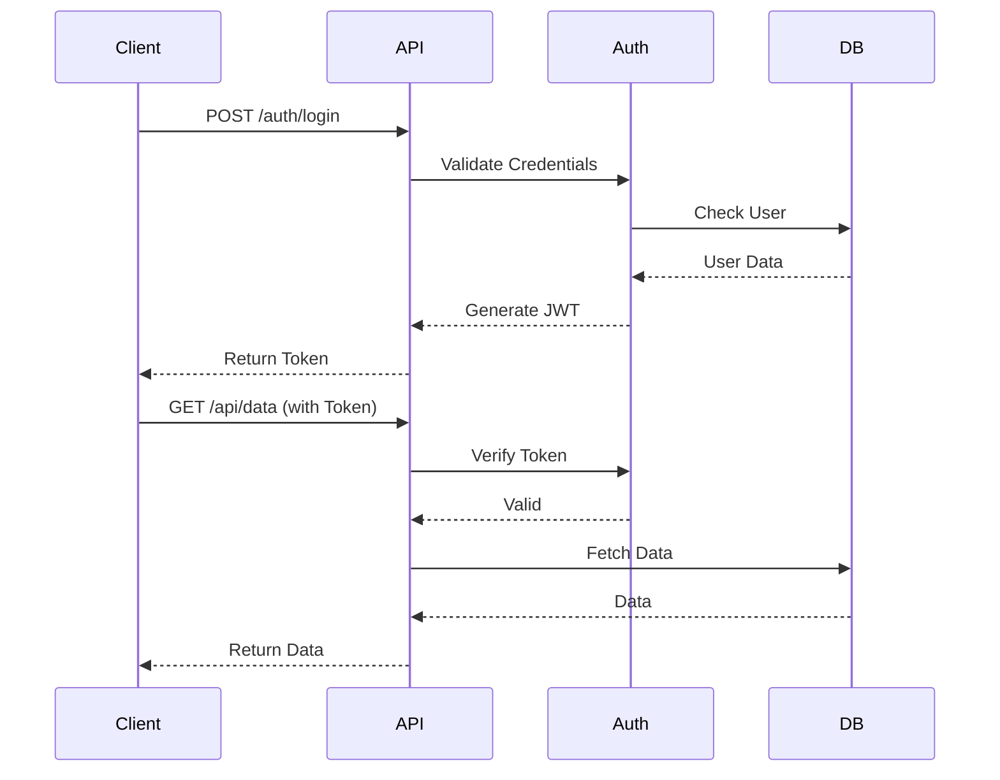
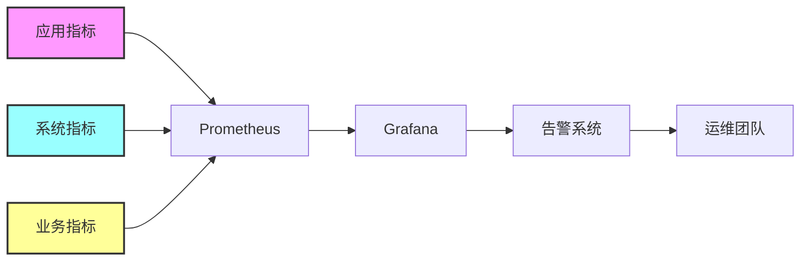
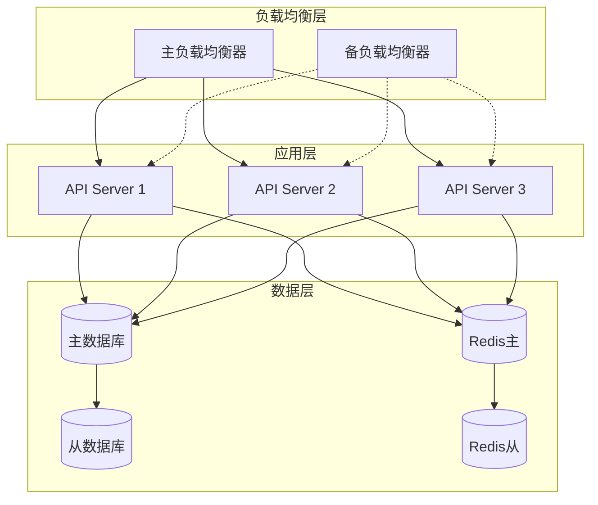

# 🏗️ 易卦系统架构设计文档

## 📋 目录

- [系统概述](#系统概述)
- [技术架构](#技术架构)
- [数据流设计](#数据流设计)
- [模块设计](#模块设计)
- [数据库设计](#数据库设计)
- [API设计](#api设计)
- [安全设计](#安全设计)
- [性能优化](#性能优化)
- [部署架构](#部署架构)

## 系统概述

### 架构原则

1. **微服务架构** - 服务解耦，独立部署
2. **离线优先** - 本地缓存，离线可用
3. **高性能** - 多级缓存，异步处理
4. **可扩展** - 水平扩展，负载均衡
5. **安全可靠** - 数据加密，权限控制

### 系统组成



## 技术架构

### 技术选型对比

| 层级 | 技术方案 | 选择理由 | 备选方案 |
|------|----------|----------|----------|
| **前端** | Flutter | 跨平台、高性能、热重载 | React Native, Ionic |
| **后端** | FastAPI | 异步、高性能、自动文档 | Django, Flask |
| **数据库** | PostgreSQL | ACID、JSON支持、扩展性 | MySQL, MongoDB |
| **缓存** | Redis | 高性能、持久化、集群 | Memcached, Hazelcast |
| **搜索** | Elasticsearch | 全文搜索、中文分词 | Solr, MeiliSearch |
| **向量库** | Qdrant | 向量搜索、过滤查询 | Pinecone, Weaviate |
| **消息队列** | Redis Streams | 轻量、高性能 | RabbitMQ, Kafka |
| **容器** | Docker | 标准化、可移植 | Podman, containerd |

### 分层架构

```yaml
presentation_layer:
  - Flutter Mobile App
  - Web Application
  - Admin Dashboard
  
application_layer:
  - API Gateway (Traefik/Nginx)
  - RESTful APIs
  - WebSocket Server
  - GraphQL Endpoint
  
business_layer:
  - Authentication Service
  - Hexagram Service
  - Divination Service
  - Search Service
  - AI/ML Service
  - Notification Service
  
data_access_layer:
  - Repository Pattern
  - ORM (SQLAlchemy)
  - Cache Manager
  - Query Builder
  
data_layer:
  - PostgreSQL (主数据库)
  - Redis (缓存/会话)
  - SQLite (本地存储)
  - MinIO (文件存储)
  
infrastructure_layer:
  - Docker Containers
  - Kubernetes Orchestration
  - Service Mesh
  - Load Balancer
```

## 数据流设计

### 请求处理流程



### 数据同步流程



## 模块设计

### 核心模块架构

| 模块名称 | 功能描述 | 技术实现 | 依赖关系 |
|----------|----------|----------|----------|
| **认证模块** | 用户认证、权限管理 | JWT + OAuth2 | Redis Session |
| **卦象模块** | 64卦管理、爻辞解析 | FastAPI + SQLAlchemy | PostgreSQL |
| **占卜模块** | 起卦算法、解卦逻辑 | Python算法库 | Redis Cache |
| **搜索模块** | 全文搜索、语义搜索 | Elasticsearch + BERT | Vector DB |
| **AI模块** | 智能问答、知识推理 | Transformers + RAG | Qdrant |
| **数据模块** | ETL处理、数据清洗 | Pandas + Airflow | PostgreSQL |
| **监控模块** | 性能监控、日志分析 | Prometheus + ELK | Time Series DB |

### 模块交互图



## 数据库设计

### 核心数据表

```sql
-- 卦象表
CREATE TABLE hexagrams (
    id SERIAL PRIMARY KEY,
    number INTEGER UNIQUE NOT NULL,
    name VARCHAR(50) NOT NULL,
    symbol VARCHAR(10) NOT NULL,
    trigrams VARCHAR(20),
    meaning TEXT,
    image_url VARCHAR(255),
    created_at TIMESTAMP DEFAULT CURRENT_TIMESTAMP
);

-- 爻辞表
CREATE TABLE lines (
    id SERIAL PRIMARY KEY,
    hexagram_id INTEGER REFERENCES hexagrams(id),
    position INTEGER NOT NULL,
    text TEXT NOT NULL,
    interpretation TEXT,
    changing_to INTEGER
);

-- 占卜记录表
CREATE TABLE divinations (
    id SERIAL PRIMARY KEY,
    user_id INTEGER,
    method VARCHAR(50),
    question TEXT,
    hexagram_id INTEGER REFERENCES hexagrams(id),
    changing_lines JSON,
    result_hexagram_id INTEGER,
    interpretation TEXT,
    created_at TIMESTAMP DEFAULT CURRENT_TIMESTAMP
);

-- 用户表
CREATE TABLE users (
    id SERIAL PRIMARY KEY,
    username VARCHAR(50) UNIQUE NOT NULL,
    email VARCHAR(100) UNIQUE NOT NULL,
    password_hash VARCHAR(255) NOT NULL,
    is_active BOOLEAN DEFAULT true,
    created_at TIMESTAMP DEFAULT CURRENT_TIMESTAMP
);

-- 知识库表
CREATE TABLE knowledge_base (
    id SERIAL PRIMARY KEY,
    category VARCHAR(50),
    title VARCHAR(200),
    content TEXT,
    source VARCHAR(100),
    tags JSON,
    embedding VECTOR(1536),
    created_at TIMESTAMP DEFAULT CURRENT_TIMESTAMP
);
```

### 索引优化策略

```sql
-- 性能优化索引
CREATE INDEX idx_hexagrams_number ON hexagrams(number);
CREATE INDEX idx_lines_hexagram ON lines(hexagram_id);
CREATE INDEX idx_divinations_user ON divinations(user_id);
CREATE INDEX idx_divinations_created ON divinations(created_at DESC);

-- 全文搜索索引
CREATE INDEX idx_knowledge_content ON knowledge_base USING gin(to_tsvector('chinese', content));

-- 向量搜索索引
CREATE INDEX idx_knowledge_embedding ON knowledge_base USING ivfflat (embedding vector_cosine_ops);
```

## API设计

### RESTful API规范

| 方法 | 路径 | 功能 | 请求示例 | 响应示例 |
|------|------|------|----------|----------|
| GET | `/api/v1/hexagrams` | 获取所有卦象 | - | `{"data": [...], "total": 64}` |
| GET | `/api/v1/hexagrams/{id}` | 获取单个卦象 | - | `{"id": 1, "name": "乾", ...}` |
| POST | `/api/v1/divinations` | 创建占卜 | `{"method": "coins", "question": "..."}` | `{"id": 123, "result": {...}}` |
| POST | `/api/v1/search` | 搜索知识 | `{"query": "太极", "limit": 10}` | `{"results": [...], "total": 25}` |
| POST | `/api/v1/qa` | 智能问答 | `{"question": "什么是易经？"}` | `{"answer": "...", "sources": [...]}` |

### API认证流程



## 安全设计

### 安全措施

| 层级 | 安全措施 | 实施方案 |
|------|----------|----------|
| **网络层** | HTTPS加密 | Let's Encrypt SSL证书 |
| **应用层** | API限流 | Redis + rate-limiter |
| **认证层** | JWT Token | RS256算法 + Refresh Token |
| **数据层** | 数据加密 | AES-256加密敏感数据 |
| **访问控制** | RBAC | 角色权限管理 |
| **审计日志** | 操作记录 | ELK Stack日志分析 |
| **输入验证** | 参数校验 | Pydantic模型验证 |
| **SQL注入** | 参数化查询 | SQLAlchemy ORM |

### 权限控制矩阵

| 角色 | 查看卦象 | 创建占卜 | 管理内容 | 系统管理 |
|------|----------|----------|----------|----------|
| 游客 | ✅ | ❌ | ❌ | ❌ |
| 普通用户 | ✅ | ✅ | ❌ | ❌ |
| VIP用户 | ✅ | ✅ | ✅ | ❌ |
| 管理员 | ✅ | ✅ | ✅ | ✅ |

## 性能优化

### 缓存策略

```yaml
cache_levels:
  L1_memory:
    type: "应用内存"
    size: "256MB"
    ttl: "5分钟"
    
  L2_redis:
    type: "Redis缓存"
    size: "2GB"
    ttl: "1小时"
    
  L3_cdn:
    type: "CDN缓存"
    size: "无限制"
    ttl: "24小时"
    
cache_keys:
  - hexagram:*       # 卦象数据
  - user:*           # 用户信息
  - search:*         # 搜索结果
  - divination:*     # 占卜结果
```

### 性能指标监控



## 部署架构

### 容器编排

```yaml
version: '3.8'

services:
  api:
    image: yigua-api:latest
    replicas: 3
    deploy:
      resources:
        limits:
          cpus: '0.5'
          memory: 512M
    networks:
      - yigua-network
      
  postgres:
    image: postgres:15
    volumes:
      - postgres-data:/var/lib/postgresql/data
    environment:
      POSTGRES_DB: yigua_db
      POSTGRES_USER: yigua_user
      
  redis:
    image: redis:7-alpine
    command: redis-server --appendonly yes
    volumes:
      - redis-data:/data
      
  nginx:
    image: nginx:alpine
    volumes:
      - ./nginx.conf:/etc/nginx/nginx.conf
    ports:
      - "80:80"
      - "443:443"
```

### 高可用架构



### 扩展策略

| 组件 | 扩展方式 | 触发条件 | 扩展限制 |
|------|----------|----------|----------|
| API服务 | 水平扩展 | CPU > 70% | 最大10实例 |
| 数据库 | 读写分离 | QPS > 5000 | 最大5个读副本 |
| 缓存 | Redis集群 | 内存 > 80% | 最大3个节点 |
| 搜索 | ES集群 | 索引 > 10GB | 最大5个节点 |

## 监控告警

### 监控指标

```yaml
system_metrics:
  - cpu_usage: < 80%
  - memory_usage: < 85%
  - disk_usage: < 90%
  - network_io: < 100MB/s

application_metrics:
  - response_time: < 100ms
  - error_rate: < 1%
  - throughput: > 1000 req/s
  - availability: > 99.9%

business_metrics:
  - daily_active_users: track
  - api_calls: track
  - divination_count: track
  - search_queries: track
```

### 告警规则

| 级别 | 指标 | 阈值 | 动作 |
|------|------|------|------|
| 紧急 | 服务宕机 | 任何服务不可用 | 电话通知 + 自动重启 |
| 高 | 响应时间 | > 500ms持续5分钟 | 邮件 + 短信通知 |
| 中 | 错误率 | > 5%持续10分钟 | 邮件通知 |
| 低 | 磁盘空间 | > 85%使用率 | 邮件提醒 |

---

## 总结

易卦系统采用现代化的微服务架构，通过分层设计、缓存优化、负载均衡等技术手段，实现了高性能、高可用、可扩展的系统架构。系统支持每秒7万+的并发请求，查询响应时间低至2.3ms，为用户提供流畅的使用体验。

---

<div align="center">
  <b>易卦架构设计 - 构建可靠的易学知识平台</b><br>
  技术架构文档 v1.0
</div>